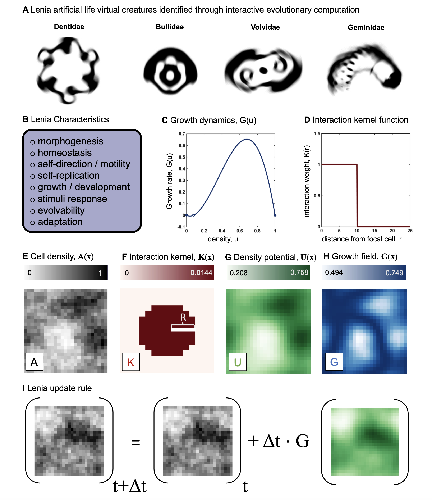

# Lenia-in-HAL
Repository for Lenia framework, implemented in Hybrid Automata Library (HAL), which can be downloaded [here](https://github.com/mathonco/hal). Below we implement the "Lenia" modeling framework in HAL v1.1.0.

Lenia is a cellular automata framework developed [here](https://chakazul.github.io/lenia.html) that offers capabilities for simulating cellular automata that have continuous space and time components, making it suitable for studying the collective behavior of interacting biological agents, such as individual cells or organisms. Cellular automata are valuable tools for studying the rules governing the behavior of complex systems, including multi-factorial diseases like cancer. 

Below is an image (originally appearing [here](https://www.biorxiv.org/content/10.1101/2024.01.10.575036v2.abstract)) that describes Lenia. Lenia as a cancer model: 


(A) Lenia artificial life virtual creatures, reproduced from [Chan, 2018](https://arxiv.org/abs/1812.05433). (B) List of characteristics possible to produce in Lenia by varying the growth dynamics function (C) or the interaction kernel function (D). (E) An example snapshot of a simulation shows the density of cells at each lattice location where the interaction kernel (F) specifies the nature of interaction of cells depending on their distance from each other. (G) The density potential, interpreted as a weighted average of interactions at each lattice location, is calculated as the convolution of A(x) and K(x). (H) the growth field calculated by applying a growth map to the density potential. (I) adding a fraction of the growth field at each time step to the cell density, forms the Lenia update rule.


## Overview

Lenia-in-HAL is developed at [the EDIT lab](https://labpages.moffitt.org/westj/) at the H. Lee Moffitt Cancer Center and Research Institute. It provides various features essential for cancer modeling, including:

- Cellular replication
- Growth
- Motility
- Evolvability
- Adaptation

## Features

Lenia is designed to recapitulate various models commonly used in cancer research, including:

1. **Classical Analytical Models**: Lenia can simulate ordinary differential equations commonly used in cancer research.
2. **Stochastic Agent-Based Models**: It supports common stochastic agent-based models of cancer.
3. **Evolutionary Game Theory**: Lenia can model multiple cell types competing on Darwinian fitness landscapes.
4. **Cell Migration**: It includes generalized cell migration models like chemotaxis commonly used in cancer mathematical modeling literature.

## Usage

Lenia is easy to implement and supports single or multiple players (cell types). Users can define growth functions and various kernel sizes/functions for spatial interaction. More details on using Lenia in cancer modeling can be found in [this paper](https://www.biorxiv.org/content/10.1101/2024.01.10.575036v2.abstract).

There are two steps to defining and implementing a model in Lenia: 1) define the Growth function, `G(u)` and 2) define the kernel of cell interaction, `K(r)`.

For example, we implement logistic growth with an Allee effect by overriding the G function in ExampleDeterministic1Player.java:

```
    // Growth function
    @Override
    public double G(double u) {
        return gamma * u * (u - L) * (C - u);
    }
```

where `gamma`, `L`, and `C` are constants. This function defines the growth rate of each lattice location as a function of `u`, the density potential. Density potential is determined by the weighted sum of the density of a focal cell's neighborhood, as defined by the interaction kernel. For example, we can define the neighborhood as the cells within a radius of `Rstar` as follows:

```
    @Override
    public double K(double r) {
        if (r <= Rstar) {
            return 1.0;
        } else {
            return 0.0;
        }
    }
```

Thus, each cell within a radius of `Rstar` will be equally weighted. If neighborhood is empty then `u = 0`, if maximum capacity then `u = 1`.

For help getting started with HAL, we recommend checking out the manual [halloworld.org/setup](halloworld.org/setup) for information on how to setup HAL on your operating system.

## Examples
Four examples are provided in the Examples folder. We recommend starting here, and editing the G and K functions of these examples for your own purposes.

- ExampleDeterministic1Player.java
- ExampleDeterministic2Player.java
- ExampleStochastic1Player.java
- ExampleStochastic2Player.java


## License

Lenia is open-source software licensed under the MIT License.

## Contributing & Contact

Contributions to Lenia are welcome! If you're interested in contributing, please fork this repository or contact us directly. For any questions, feedback, or support, please contact [the EDIT lab](https://labpages.moffitt.org/westj/) at the H. Lee Moffitt Cancer Center and Research Institute.

